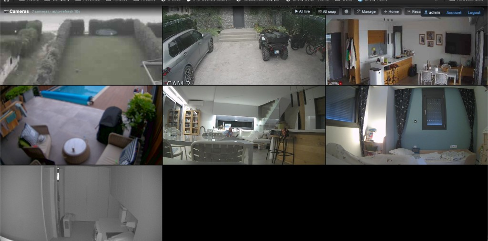
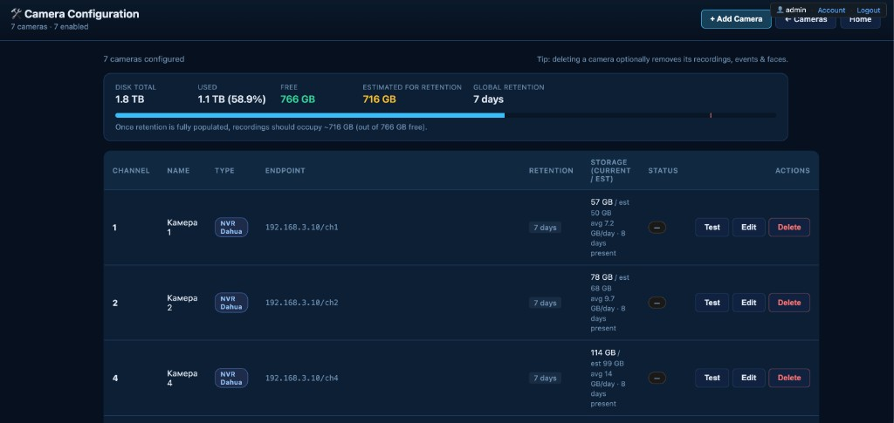
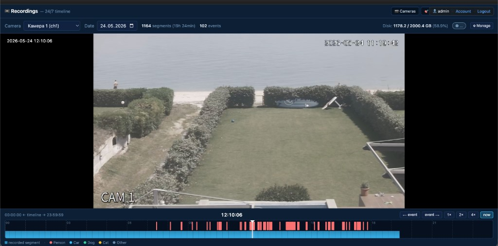
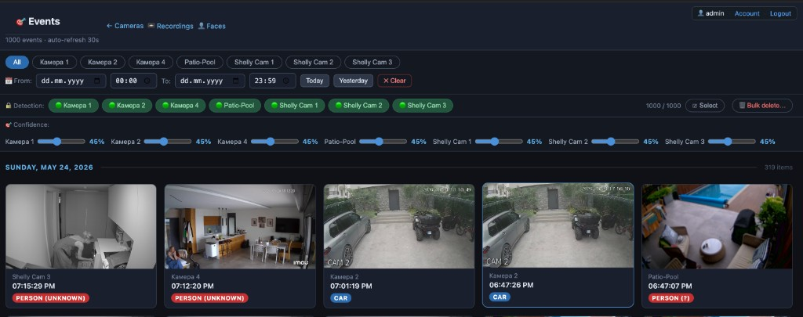

# Shelly NAS Hub

> Self-hosted camera hub for **Shelly cameras**, generic **RTSP cameras** and
> **Dahua-compatible NVRs** — with AI object detection, face recognition,
> 24/7 recording and a clean web UI.

[](LICENSE)
[](https://www.python.org/)


---

## Features

- **Multi-camera support**
  - Shelly Plus/Pro Cameras (HTTP snapshot + WebRTC stream)
  - Generic RTSP cameras (Reolink, IMOU, Hikvision, Dahua, …)
  - Dahua-compatible NVR/DVR channels
- **AI object detection** with [YOLO26 / YOLOv8](https://ultralytics.com/)
  (people, cars, motorcycles, trucks, cats, dogs — configurable)
- **Face recognition** with [InsightFace](https://github.com/deepinsight/insightface)
  (SCRFD detection + ArcFace 512-d embeddings, agglomerative clustering)
- **24/7 continuous recording** with FFmpeg, segmented MP4, per-camera retention
- **Live grid + recordings timeline** in browser (HLS playback)
- **Single-user authentication** (bcrypt + signed session cookie) — *optional*
- **Storage dashboard** — current usage, projected usage, per-camera retention
- **Pure web UI** — runs on phone, tablet, desktop

## Screenshots

### Live grid — multi-camera view with per-camera controls


### Camera management — add/edit/delete + per-camera retention & storage


### Recordings — 24/7 timeline with detection markers + HLS playback


### Detection events — filterable by camera, day & confidence


## Quick Start (Docker Compose)

### Requirements

- Docker + Docker Compose v2
- ~2 GB RAM (for YOLO26s + InsightFace inference on CPU)
- ~1 GB disk for the image, **plus** plenty of space for recordings
  (24/7 rolling window with 5 cameras at "main" quality ≈ 60–120 GB / week)

### Install

```bash
git clone https://github.com/kmetabg/Shelly-NAS-hub.git
cd Shelly-NAS-hub
cp env.example .env
# edit .env — at minimum set TZ + (optional) NVR_* seeding
docker compose up -d --build
```

Open <http://localhost/> — the dashboard appears. Add cameras in
**Settings → Cameras**.

### Recordings volume

By default `./recordings` (host-mounted) is used. For real deployments mount
a dedicated SSD/HDD:

```yaml
# docker-compose.yml override
services:
  app:
    volumes:
      - /mnt/ssd/cam-recordings:/recordings
```

…or set `RECORDINGS_PATH=/mnt/ssd/cam-recordings` in `.env`.

## Adding cameras

After first start, open **Settings (`/cameras-config.html`)** and click
**“+ Add Camera”**. Three camera types are supported:

| Type     | Required fields                                                                                       |
|----------|-------------------------------------------------------------------------------------------------------|
| `rtsp`   | `name`, `rtsp_url`, optional `snapshot_url` (HTTP), `has_audio`                                       |
| `shelly` | `name`, `host` (e.g. `192.168.1.50`), optional `auth_user`/`auth_pass`                                |
| `nvr`    | `name`, `nvr_channel` (channel number on the configured NVR)                                          |

Per-camera retention can override the global `RECORDING_RETENTION_DAYS`.

## Authentication (single user)

Disabled by default. To turn on:

```bash
# Generate hash + secret
python3 -c "import bcrypt; print(bcrypt.hashpw(b'YOUR_PASSWORD', bcrypt.gensalt()).decode())"
python3 -c "import secrets; print(secrets.token_hex(32))"
```

Then in `.env`:

```ini
HOMEHUB_AUTH_ENABLED=true
HOMEHUB_AUTH_USER=admin
HOMEHUB_AUTH_PASSWORD_HASH='$2b$12$...'   # ← single quotes (contains $)
HOMEHUB_AUTH_SECRET=<token from secrets.token_hex>
```

`docker compose up -d` (no rebuild needed). Sign in at `/login.html`.
Change password later in **Account (`/account.html`)** — the new hash is
persisted to `data/auth_override.json` (in-volume, survives rebuilds).

## Architecture

```
Browser ─▶ nginx :80 ─┬─▶ static/* (HTML, JS, CSS)
                     └─▶ /api/*  ─▶ FastAPI (uvicorn :8080)
                                    ├─ Camera registry (SQLite)
                                    ├─ YOLO worker (5s loop)
                                    ├─ Face extraction worker
                                    ├─ FFmpeg recorders (one per camera)
                                    └─ Disk cleanup loop (per-camera retention)
```

- **SQLite** under `/data/history.db`
  - `cameras`, `detection_events`, `face_clusters`, `face_crops`, `detection_config`
- **Recordings** under `/recordings/<channel>/<YYYY-MM-DD>/<HH-MM-SS>.mp4`
- **Face crops** under `/data/faces/<cluster_id>/<crop_id>.jpg`
- **Event images** under `/data/events/<channel>/<timestamp>.jpg`

## API quick reference

| Endpoint                                          | Method | Description                                |
|---------------------------------------------------|--------|--------------------------------------------|
| `/health`                                         | GET    | Liveness + feature flags                   |
| `/api/cameras`                                    | GET    | List cameras                               |
| `/api/cameras`                                    | POST   | Create camera                              |
| `/api/cameras/{id}`                               | PUT    | Update camera                              |
| `/api/cameras/{id}`                               | DELETE | Delete camera (`?keep_recordings=1` opt.)  |
| `/api/cameras/storage`                            | GET    | Disk usage + per-camera estimates          |
| `/api/camera/{ch}/snapshot`                       | GET    | Latest JPEG snapshot                       |
| `/api/camera/{ch}/stream`                         | GET    | MJPEG live stream                          |
| `/api/recordings/cameras`                         | GET    | Per-camera recording stats                 |
| `/api/recordings/{ch}/timeline`                   | GET    | Day-level segment listing                  |
| `/api/recordings/{ch}/segment?path=…`             | GET    | Stream a single segment                    |
| `/api/faces/clusters`                             | GET    | Face clusters with representatives         |
| `/api/faces/clusters/{id}/name`                   | POST   | Rename a cluster                           |

Full list at `/docs` (FastAPI Swagger UI).

## Troubleshooting

### Recordings are not being saved (only snapshots / events appear)

**Short answer:** no, NFS does **not** need to be configured on the camera —
the hub pulls the stream itself. If recordings are missing, one of the
following is the cause:

1. **Old image without the `shelly-webrtc-grab` Go binary** *(the most common
   case for `shelly` camera type)*. Shelly cameras don't expose RTSP — the
   hub has to talk WebRTC to them via a small Go helper that ships inside
   the Docker image. If you built before this binary was added, snapshots
   and AI events still work (HTTP), but recording silently fails. **Fix:**
   ```bash
   git pull
   docker compose build --no-cache app
   docker compose up -d
   ```
2. **Recording is disarmed for that camera.** Open `/cameras.html`, click
   the cog on the camera tile, and check that **"24/7 recording"** is on.
   You can also `curl http://HOST/api/recordings/cameras` and look at the
   `armed` flag.
3. **The `/recordings` volume is read-only or out of space.** Check with
   `docker compose exec app df -h /recordings` and
   `ls -la /recordings/<channel>/`. The hub auto-prunes when usage exceeds
   `RECORDING_DISK_LIMIT_PCT` (default 90 %) — if the disk is already that
   full, no new segments are written.
4. **FFmpeg can't reach the camera.** Inspect logs:
   ```bash
   docker compose logs --tail=200 app | grep -E "ffmpeg|FFmpeg|cam[0-9]"
   ```
   For RTSP cameras verify the URL with VLC first. For Shelly cameras
   verify `http://<camera-ip>/rpc/Streamer.Offer` returns SDP when called
   from the host running Docker.
5. **Camera works for snapshots but not stream.** Some Shelly firmwares
   require WebRTC to be enabled in the camera's web UI under
   *Settings → Streaming*.

### "All Live" tiles stay black with a spinner

Hard-refresh the browser (Cmd/Ctrl + Shift + R) — `hls.js` is cached
aggressively. If it persists, check `docker compose logs nginx` for 404s
on `*.ts` segments — they should resolve to
`/api/recordings/<ch>/live/liveN.ts`.

## Development

The HTML UI is plain static files served by nginx — **no rebuild needed**:

```bash
# Edit anything under static/ → hard-refresh in browser.
```

Backend changes (`app/main.py`):

```bash
docker compose up -d --build
```

## License

[MIT](LICENSE) © 2025 [kmetabg](https://github.com/kmetabg)

## Acknowledgements

- [Ultralytics YOLO](https://ultralytics.com/) — object detection
- [InsightFace](https://github.com/deepinsight/insightface) — face recognition
- [FastAPI](https://fastapi.tiangolo.com/) + [uvicorn](https://www.uvicorn.org/)
- [hls.js](https://github.com/video-dev/hls.js/) — in-browser HLS playback
- [FFmpeg](https://ffmpeg.org/) — recording / transcoding
